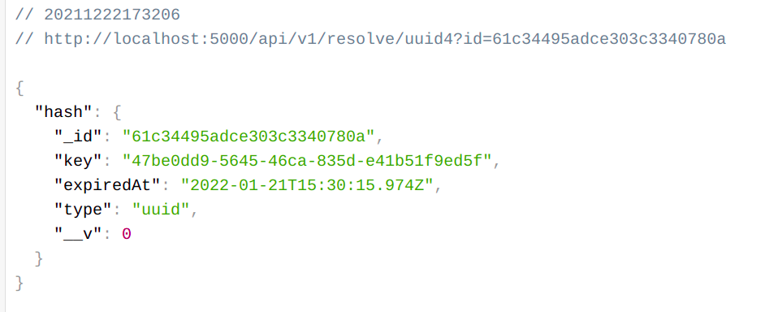
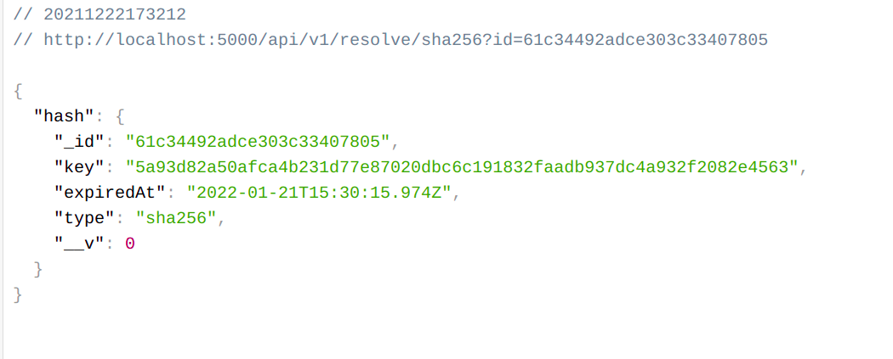
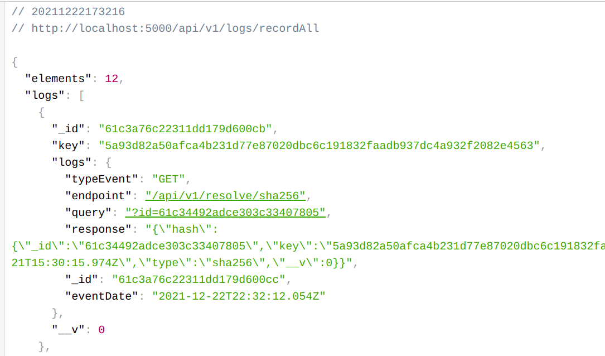

# Backend Restify MongoDB - Reto 2 Backend Logs

EndPoints:

POST HASH: 
 - http://localhost:5000/api/v1/generate/uuid4
 - http://localhost:5000/api/v1/generate/sha256
 
GET HASH:
 
 - http://localhost:5000/api/v1/resolve/uuid4All
 - http://localhost:5000/api/v1/resolve/sha256All

 - http://localhost:5000/api/v1/resolve/uuid4?id=xxxx

 - http://localhost:5000/api/v1/resolve/sha256?id=xxxx

LOGS:
 - http://localhost:5000/api/v1/logs/record?id=xxxx
 - http://localhost:5000/api/v1/logs/recordAll

